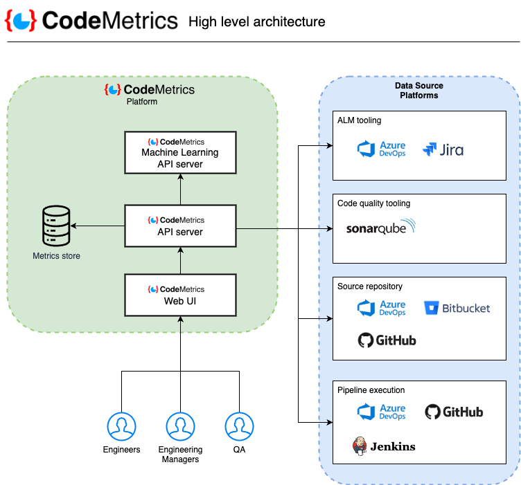

# CodeMetrics Threat Model

Commit Hash: a96c512
Release Tag: 2.23.4

This page serves to hold the CodeMetrics threat model. Threat modelling is a practical approach to reviewing a system's security architecture in order to identify real world threats to that system and remediations that best address the risks of those threats being realised. By analysing data flows, security controls and threats, an understanding of a solutions security posture can be gained.

# Notice

CodeMetrics is a product undergoing significant development at variable release cadences. Therefore, any threat model should be considered a working document which will evolve over time as new threats are discovered and as CodeMetrics evolves. Any threat model should be considered an advisory document to provide security guidance and improvements, rather than a complete list of all possible threats. Please consult the Scope section for further details. Threat models are typically carried out against a particular system within a given environment or client; this is threat model aims to be relatively environment agnostic in order to be widely applicable to multiple engagements. Therefore, there may be threats that are unique to your particular engagement that will not appear within this threat model due to it's agnosticism. If you wish to contribute generalizable threats that are not related to your client environment, please see the CodeMetrics contributors.

# Q1 - What are we building?

Task: Define the scope of the application. The goal of this task is to define the scope of the application, component or feature in scope for the threat assessment. In this step, a system overview is provided.

Each component of the threat model is visible in the following documents:

* [CodeMetrics - Web UI](./threat_model_web_ui.md)
* [CodeMetrics - CodeMetrics API](./threat_model_cmapi.md)
* [CodeMetrics - Web UI](./threat_model_metrics_store.md)

Mitigations for each of the above components are visible in the following document:

* [CodeMetrics - Mitigations](./threat_model_mitigations.md)

## Scope

The scope of this threat model will be threats posed to the application architecture of CodeMetrics. These are threats that exploit the inherent design choices that have been made.

The information that has been gathered to inform this threat model has come primarily from:

* CodeMetrics GitHub Repository

The following items are excluded from the threat assessment scope:

* Security of upstream data sources themselves
* Security of the environment CodeMetrics is deployed within
* Reliability of the underlying platform CodeMetrics is deployed on

# Q2 - What can go wrong?

The objective of this phase is to define unacceptable outcomes and their likely causes (threats). Vital to this stage is to analyse security from the perspective of an attacker:

* "What is my motivation to attack this system?"
* "What am I trying to achieve?"
* "How would I go about this?"

To aid in this analysis, we will use the STRIDE approach to identifying how each CodeMetrics component could be subjected to threats. STRIDE consists of the following elements:

* Spoofing (Authentication)
* Tampering (Integrity)
* Repudiation (Non Repudiation)
* Denial of Service (Availability)
* Elevation of Privilege (Authorisation)

